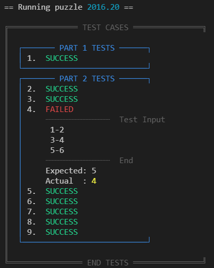

# Advent of Code
This repository contains my solutions for [Advent of Code](https://adventofcode.com) problems along with a framework to participate in competitive solving. All solutions are implemented in TypeScript and JavaScript, runnable with modern Node.js.

** IF YOU DO NOT WANT SPOILERS, AVOID LOOKING IN THE `years` FOLDER! **

## What do you get?

This framework includes a number of useful tools for interfacing with Advent of Code and solving the problems. For those interested in competing on speed, it includes tools that help automate key tasks for a advantage.

  * Automatically download problem data the second it comes available
  * Automatically generate a ready-to-run solution file for the downloaded problem data
  * Command-line submission of solutions
  * Simple test framework for checking given test cases and custom test cases
  * Solution runner
  * Very small library of commonly-used algorithms and patterns (e.g. graph and tree traversal, grids, number theory, etc.)

## What you should know (read this!)

  * Everything is in TypeScript and intended to be run with `ts-node`, but using the `--transpile-only` [flag](https://typestrong.org/ts-node/docs/options/) (or its corresponding environment variable) should allow you to use plain JavaScript. Not tested with JavaScript, so there may be other tweaks to be made.
  * Solutions are contained in the `years/<year>/<day>/index.ts` file. A solution file contains both part 1 and part 2. The data for the problem is saved in a sibling file `data.txt`.
  * Every time a solution is run, the result is cached. The most recently-computed solution is *always* the one that is submitted when `submit.ts` is run.
  * There is NO flooding prevention! If you use this framework to flood the Advent of Code servers with requests, your account may be timed out or banned. Use this software at your own risk.
    * I've not seen any issues downloading all all 6 years of problem data in a single command, but this is anecdotal evidence.
  * If you run one of my solutions against your data and it doesn't get the right answer, sorry. I don't care.

## Usage

### Prerequisites: 

  * Install [Node.js](https://nodejs.org) 16 (LTS) or later
  * Create an account at https://adventofcode.com/
  * Fork this repository
  * Clone the forked repository
  * `cd` into the root of the repository and run `npm install`
  * Globally install `ts-node` by running `npm install -g ts-node` (or prepend `npx` to every `ts-node` command in this documentation)

### Authenticate

  Some features of this framework make API requests to Advent of Code on your behalf. In order to do this, it needs a current session token. To get your session token, run `ts-node login`. The easiest way to get your token is the "Interactive" method, which will automatically open a browser window to your preferred auth provider and get the session token from the cookie that the Advent of Code server sets. If this makes you nervous, you can use the manual method. Choosing this will show instructions on-screen for getting your token.

  Once the login.ts script has your token, it saves it to a file at `./.scratch/sessionToken`. Please note that while the token's expiration date is set to several years in the future, other events may cause the token to expire, in which case you would need to log in again.

### Initializing your solutions and data

  In your forked repository, delete the `years` folder (it contains my solutions and will be rebuilt).

  The file `init.ts` helps with sucking in your problem data and seeding your solution files. Use the following command to suck down all data for the current year and seed the solution files: `ts-node init suck seed`. See below for more information on `init.ts`.

  Once this is done, the folder `years/<current_year>` will contain a folder for each day, each of which includes your personalized data file and a solution file ready-to-run. Go ahead, run `ts-node run` and see that it prints out "Not implemented" for Part 1 and Part 2 of the most recently-released problem. That's your job!

### Running your solutions

  The script `run.ts` is intended to make it easy to run any given solution file. With no arguments, it will run the solution file for the most recently-released problem. Otherwise, include the year and the problem number to run that solution.

  Examples:
  
  * `ts-node run` - runs the solution for the most recently-released problem
  * `ts-node run 2019 1` - runs the solution for problem 1 of year 2019
  * `ts-node run 1 2019` - runs the solution for problem 1 of year 2019

  Options:

  * `--debug` - turns on debug tracing. Strings logged from the `trace()` function will be printed to the console.
  * `--no-tests` - turns off test execution (rarely needed unless your test cases are slow or causing other problems).
  * `--help` - prints help information.

### Debugging

If you are using VS Code, a launch configuration is included that enables breakpoint-based debugging. Just add a breakpoint and press F5 to start debugging the current file.

### Test cases

This package includes a small test framework to help you validate your solutions. The default TypeScript template runs all test cases by default.

Test cases are split into 2 sections, one for Part 1 and one for Part 2. **In most cases** all you need to do to add a test case is add to the `part1tests` or `part2tests` array. A test case is an object with 2 properties: `input` and `expected`. For an example, see ./years/2015/01/index.ts.

In some cases, the test cases given change some of the core parameters of the problem. In other words, the test case gives a value for your puzzle input, but also changes one of the values stated in the problem text itself. As an example, see [2016 Day 20](https://adventofcode.com/2016/day/20). In that problem, a test case with 3 lines of puzzle input is given, but it also says that the numbers 0-9 are the only valid IP's rather than 0-4294967295, as used in the regular problem.

In this case, you can add `extraArgs` to your test case object. This is an array, which will be passed as additional arguments to the solution function. To see a full example, see ./years/2016/20/index.ts.

When your solution is run, test cases will be printed before the puzzle answer. If a test fails, it will display the input, expected value, and computed answer.

If you need to suppress test execution and output, pass `--no-tests` when executing `run.ts`.

### Submitting a solution

All you have to do is run `ts-node submit`. This will submit your *most-recently-computed` solution. Once you run your program, if it outputs an answer you are satisfied with, simply run the submit script. The script will display feedback based on your answer:

* Correct (1 gold star!)
* Wrong (too high)
* Wrong (too low)
* Wrong (no additional feedback given)

Note: Status of test cases has NO bearing on answer submission. It's a good idea to make sure your tests pass before submitting a solution!

#### Cooldown period

If you submit a solution too quickly after your previous submission, AoC will show a cooldown message indicating the number of seconds you must wait until you can re-submit. The `submit.ts` script will remember the cooldown period, so the next time you submit, it will automatically wait for the cooldown to end before re-submitting your answer.

## Utilities

A file, `util/util.ts` is included with a hodge-podge of functions that may be useful, including:

  * clamp - combine Math.min and Math.max
  * mod - implements the modulo function (as opposed to remainder, which is what `%` is, and produces different results for negative inputs)
  * gcd - greatest common divisor
  * gcdExtended - Google it
  * lcm - least common multiple
  * modInverse
  * modDivide
  * powerMod
  * getPermutations - computes the set of permutations for a given input array
  * powerSet
  * countUniqueElements - Returns the count of each unique element in the array. Think counting each occurrence of a letter in a string.
  * max/min - accepts a map function and returns both the index and value of the max/min element in an array.
  * md5 - early AoC problems relied heavily on getting MD5 digests

Another file, `util/grid.ts`, contains a *very* useful Grid class that can be used in countless AoC problems, including cellular automata helpers. I recommend you take a look at `grid.ts` to get familiar with it - it is well-commented. See the test cases at the end of the file for some examples. You can also directly run `ts-node util/grid` to run the tests/examples.

And finally, the file `util/graph.ts` contains these functions to help with graph and tree traversal:

* topoSort - topological sort
* bfTraverse - lazily traverse a graph breadth-first
* bfSearch - breadth-first search

And finally, `package.json` includes some dependencies from npm that may be useful:

* lodash
* a-star - I really like the API for this one so I've made TypeScript types for it - see `util/@types/global/index.d.ts`.
* fast-levenshtein
* js-combinatorics - Some functions in here probably obviate ones in `util/util.ts`.

## Tips for speed

You can gain an edge of a few seconds using some of the following tips:

* Use `ts-node init suck --wait` before the next problem is released. This will automatically wait until the next problem is released and then download the data. Generally, I kick off this command and focus all my attention to the web page when the problem is released. While I'm reading the problem, the data is downloaded.
* Use the automatic submission script. Even if you are dealing with a cooldown, it can help re-submit your new answer the second the cooldown period is over.
* If you use VS Code, you can use the snippets found in `.vscode/snippets.code-snippets` to help:
  * Parse input data in various ways
  * Build test cases
  * Or write your own

## More detail on init.ts

The script `init.js` has two main functions: `suck` and `seed`.

### Suck
Suck is designed to automatically download problem data from adventofcode.com. You must have logged in with `login.ts` before running this command.

* Suck will **not** try to download data for problems that are not released yet.
* Suck will **not** try to download data for problems that have already been downloaded, *unless* `--pristine` is passed.
* Suck does **not** do anything with your session token, except as described in this readme.

#### Options
`--year <year | "all">`: Specify the year of problems to suck in. If `all` is specified in place of the year, suck in data for all available years, starting in 2015. Defaults to the current year*.

`--path <path>`: Specify the root path for writing data. Must be a fully qualified absolute path. Within this directory, directories for each year, then for each problem day will be created. Data is written to `data.txt` within the day directory.

`--pristine`: Request new data from adventofcode.com, even if the data file already exists.

`--wait`: Before sucking any data, wait until the next problem is released, then proceed normally. If the wait is more than one day, show an error and do nothing.

### Seed
Seed is designed to automatically create your solution files. The default template (`solutionTemplate.ts.dat`) sets up imports, your solution functions, data import, and logging your solution.

#### Options
`--year <year | ">`: Specify the year of problems to seed solution files. If `all` is specified in place of the year, seed for all available years, starting in 2015. Defaults to the current year**.

`--path <path>`: Specify the root path for writing data. Must be a fully qualified absolute path. Within this directory, directories for each year, then for each problem day will be created. Solution files are named `index` with a file extension found in your template file name (e.g. `solutionTemplate.js.dat` will result in solution files named `index.js`).

`--template`: Specify the path to your template file. For an example, see `solutionTemplate.ts.dat`.

`--compare-with`: This is used in case you need to update your template and want to re-generate any un-touched files. Specify the path of the template file to use as a basis for comparison to decide if we can re-generate the file without using `--pristine`.

`--pristine`: **DANGER!!** This will overwrite any existing solution files! Use with caution! You have been warned!

* The current year will resolve as last year until new problems are available. For instance, if you run this in November 2020, it will suck in problems from 2019. If you run in December 2020, you will start getting the problems from 2020.

## Advent of Code solutions
The default template sets up each solution file to automatically read the problem's data file and call 2 functions: one for Part 1 and one for Part 2. The result of calling the solution function is printed to the console on a green background.

The solution function is asynchronous by default. Even if the solution is completely synchronous, everything will still work.
